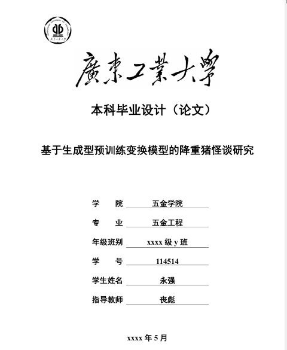

## 广东工业大学 - 本科生毕业设计 - LaTeX模板

**这只是一个自用模板的分享**，使用需要有一定的latex基础，喜欢折腾latex排版的可以了解一下。

本模板是基于数模国赛论文的latex模板修改来的，只在texlive+texstudio环境下测试过，其他环境能否正常编译未知。

为了满足厂工本科毕设的排版要求，我加入了手搓的封面页、书脊页、英文摘要页、附录页；加粗了一级、二级章节标题；调整了各浮动体的标题样式；使参考文献符合GBT7714-2015标准；文献引用处于上标；图表公式按章节编号；页码从正文开始编号。此外，我加了一些比较好的功能，如：交叉引用超链接跳转、显著性星号上标。一些很少用到的，如：中文算法浮动体、附录MATLAB代码等，不需要的话请注释掉就好了。参考文献引用建议使用bibtex形式，参考文献内容在ref.bib文件里编辑。latex的表格、图、算法等浮动体的排版顺序比较讲究，需要自己摸索。

latex的表格排版是比较复杂的环节，我给出了个人常用的普通表格、自动换行表格、复杂表格（合并行列）表格三种情形的样例以供参考。TeX公式编辑、公式交叉引用、图表交叉引用、正文脚注和表注释我也给出了使用例。

里面的作为例子的文本内容纯粹是整活，别认真。

一些借物表（侵删）：
1. 数模国赛论文latex模板（提供cumcmthesis.cls文件）
2. bibtex-GBT7714格式（提供gbt7714-numerical.bst文件）：https://github.com/zepinglee/gbt7714-bibtex-style
3. 缩短参考文献展示间距（提供bibspacing.sty）：https://blog.csdn.net/weixin_40520963/article/details/105137544
4. 书脊命令来源：https://github.com/mohuangrui/latexspine

联系邮箱：alordzero@hotmail.com
